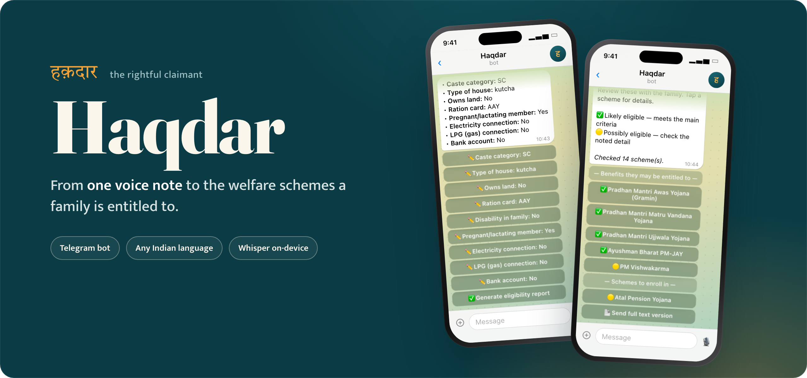
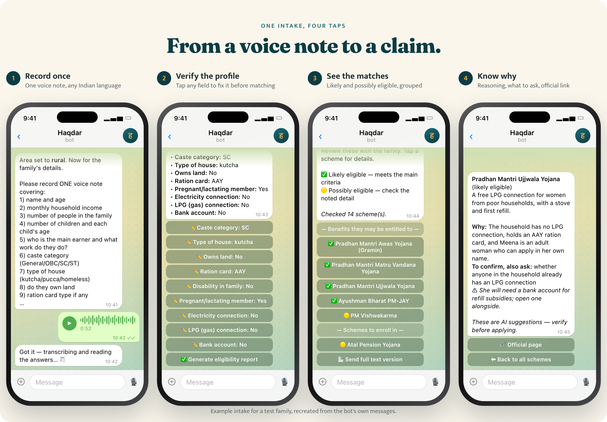

<p align="center">
  
</p>

<div align="center">


[](LICENSE)

**An AI field-intake assistant that matches families to the Indian government welfare schemes they're entitled to, from a single voice note.**<br>
<sub>Telegram bot · Python · Whisper (MLX) · Supabase</sub>

*Haqdar (हक़दार): Hindi/Urdu for "the rightful claimant; one who is entitled."*

[Overview](#overview) · [Highlights](#highlights) · [How it works](#how-it-works) · [Getting started](#getting-started) · [Status](#status-and-roadmap)

</div>

<p align="center">
  
  <br>
  <sub>An example intake for one of the test families, recreated from the bot's own messages.</sub>
</p>

> [!IMPORTANT]
> **Source-available, not open source.** This repository is published so it can be read and evaluated as part of my portfolio. See the [License](#license); the code is here to read, not to redeploy.

## Overview

India runs hundreds of welfare schemes, but the families who qualify are often the least able to navigate them. Eligibility rules are scattered, in English and buried in PDFs, and a field worker sitting with a family has minutes, not hours.

**Haqdar collapses that into one voice note.** A worker records the family's answers to a fixed checklist in any Indian language. Haqdar transcribes it, builds a structured profile, asks for anything missing, and returns a tappable, plain-language report of which schemes the family is *likely* and *possibly* eligible for, with the reasoning and source links to verify before applying.

## Highlights

| Feature | What it does |
|---|---|
| **Voice-first intake** | Workers speak instead of typing forms: one voice note per family. |
| **Any Indian language** | Whisper `large-v3` transcribes and translates to English, on-device with MLX on Apple Silicon. |
| **Structured profiles** | An LLM turns free-form speech into a typed family profile: income, caste category, housing, land, ration card, disability and more. |
| **Verify before matching** | The worker reviews the profile on an inline keyboard and corrects any field in place before a single matching call runs. |
| **Strict matching with reasons** | Every scheme starts as *not eligible*, with hard exclusions, so results aren't padded into "possibly". Each match says why and what's left to confirm. |
| **Interactive report** | Overview → per-scheme detail → full text, all editing one Telegram message in place. |

<details>
<summary><strong>Everything else it does</strong></summary>

- **Smart follow-ups**: if required fields are missing, the bot asks targeted questions (typed or by voice) for up to two rounds, then proceeds with what it has.
- **Hard exclusions**: rooftop solar needs a roof and power, artisan schemes need a real trade, scholarships need a child in range, business loans need a business.
- **Entitlements vs. enrolment**: benefits the family is owed are listed apart from voluntary, contribution-based schemes to enrol in.
- **Resilient by design**: defensive JSON parsing with retry, hard timeouts on the matching call, and graceful fallbacks so a worker is never left hanging.
- **Survives restarts**: state, the partial profile, in-progress edits and the matching result all live in the Supabase session row.

</details>

## How it works

```text
   Field worker (Telegram)
            │  voice note (Hindi / regional language)
            ▼
   ┌─────────────────────┐      audio       ┌──────────────────────────┐
   │   Telegram Bot      │ ───────────────▶ │   Whisper Server         │
   │  (python-telegram-  │                  │  FastAPI + MLX Whisper   │
   │   bot, state mach.) │ ◀─────────────── │  large-v3, translate→EN  │
   └─────────┬───────────┘   English text   └──────────────────────────┘
             │  transcript
             ▼
   ┌─────────────────────┐   structured     ┌──────────────────────────┐
   │   LLM Extraction    │   JSON profile   │   OpenRouter LLM         │
   │   + Scheme Matching │ ◀──────────────▶ │   (Gemini 2.5 Flash)     │
   └─────────┬───────────┘                  └──────────────────────────┘
             │  profile + matches
             ▼
   ┌─────────────────────┐
   │   Supabase Postgres │   sessions · profiles · schemes
   └─────────────────────┘
             │
             ▼
   Interactive eligibility report (overview ▸ per-scheme detail)
```

Each worker moves through a persisted state machine:

```text
idle → awaiting_state → awaiting_area → awaiting_recording → processing
     → awaiting_followup → verifying ⇄ editing_field → report_ready → idle
```

- **Matching never runs automatically.** It runs only when the worker taps **Generate eligibility report** on the verified profile.
- **Audio never leaves the machine for speech-to-text.** The Whisper host can be separate and reached over Tailscale.

## Tech stack

| Layer | Tools |
|---|---|
| **Messaging** |   |
| **Speech** |    |
| **AI & data** |    |
| **Runtime** |  -242424?style=flat-square&logo=tailscale&logoColor=white) |

## Getting started

**Requirements**

- Python 3.10+, and an Apple Silicon Mac for the Whisper server
- A Telegram bot token, an OpenRouter key and a Supabase project

### 1. Database

Create a Supabase project and run [`bot/schema.sql`](bot/schema.sql) in the SQL editor to create the `sessions` and `profiles` tables. Populate a `schemes` table with the welfare schemes to match against.

### 2. Whisper server

```bash
cd whisper_server
python -m venv .venv && source .venv/bin/activate
pip install -r requirements.txt
uvicorn server:app --host 0.0.0.0 --port 8000   # the MLX model (~3 GB) downloads on first run
```

Check it with `curl http://localhost:8000/health`, which returns `{"status":"ok","model_loaded":true}`.

### 3. Bot

```bash
cd bot
python -m venv .venv && source .venv/bin/activate
pip install -r requirements.txt
cp ../.env.example ../.env   # then fill in the values
python main.py
```

<details>
<summary><strong>Configuration</strong></summary>

All configuration is via `.env` (see [`.env.example`](.env.example)):

| Variable | Description |
|---|---|
| `TELEGRAM_BOT_TOKEN` | Bot token from [@BotFather](https://t.me/BotFather) |
| `WHISPER_SERVER_URL` | URL of the Whisper server (e.g. `http://localhost:8000` or a Tailscale IP) |
| `OPENROUTER_API_KEY` | OpenRouter API key for extraction and matching |
| `OPENROUTER_MODEL` | Optional override of the default model (`google/gemini-2.5-flash`) |
| `SUPABASE_URL` | Supabase project URL |
| `SUPABASE_KEY` | Supabase service-role or anon key |

</details>

<details>
<summary><strong>Using the bot</strong></summary>

| Worker action | Bot response |
|---|---|
| `/start` | Welcome and instructions |
| `initiate` / `/initiate` | Begins an intake: asks for the state, then rural or urban |
| Send a voice note | Transcribes, extracts the profile, asks follow-ups or shows the verify card |
| Reply to a follow-up | Merges the answer and continues |
| Tap a field on the verify card | Asks for the correct value and updates the profile in place |
| Tap *Generate eligibility report* | Runs scheme matching and parks the result |
| Tap *Show eligibility report* | Opens the interactive, per-scheme report |

</details>

<details>
<summary><strong>Project structure</strong></summary>

```text
haqdar/
├── bot/                    # Telegram bot: runs the intake state machine
│   ├── main.py             #   handlers + state machine entry point
│   ├── llm.py              #   OpenRouter calls, defensive JSON parsing + retry
│   ├── prompts.py          #   profile schema, checklist, all LLM prompts
│   ├── matching.py         #   scheme screening + worker-facing report text
│   ├── profile_ui.py       #   editable verify-before-match card
│   ├── report_ui.py        #   interactive inline-keyboard report
│   ├── db.py               #   Supabase access (sessions / profiles / schemes)
│   └── schema.sql          #   Postgres schema
├── whisper_server/         # FastAPI speech-to-text service (MLX Whisper)
│   └── server.py
├── .env.example            # configuration template
└── LICENSE                 # source-available license
```

</details>

## Status and roadmap

A working prototype, tested end to end against live schemes with test families.

- [x] Voice intake in any Indian language
- [x] Verify-before-match profile card
- [x] Strict matching with reasoning and source links
- [x] Interactive Telegram report
- [ ] Candidate pre-filter before the matching call (by caste, area and income) to cut cost on large scheme lists
- [ ] Persist the report state (currently in memory; lost on restart)
- [ ] Multi-worker analytics dashboard over the `profiles` history
- [ ] Document upload (Aadhaar, ration card) for higher-confidence matching

## License

**Source-available, not open source.** You may view and study the code, but copying, modifying, redistributing or using it in any product or project is not permitted without prior written permission. See [LICENSE](LICENSE) for the full terms.

For permission requests: **bharatkhanna117@gmail.com**

---

<div align="center">
  <sub>Built by <a href="https://github.com/waterduckpani">Bharat Khanna</a> · <a href="https://github.com/waterduckpani?tab=repositories">More projects</a></sub>
</div>
